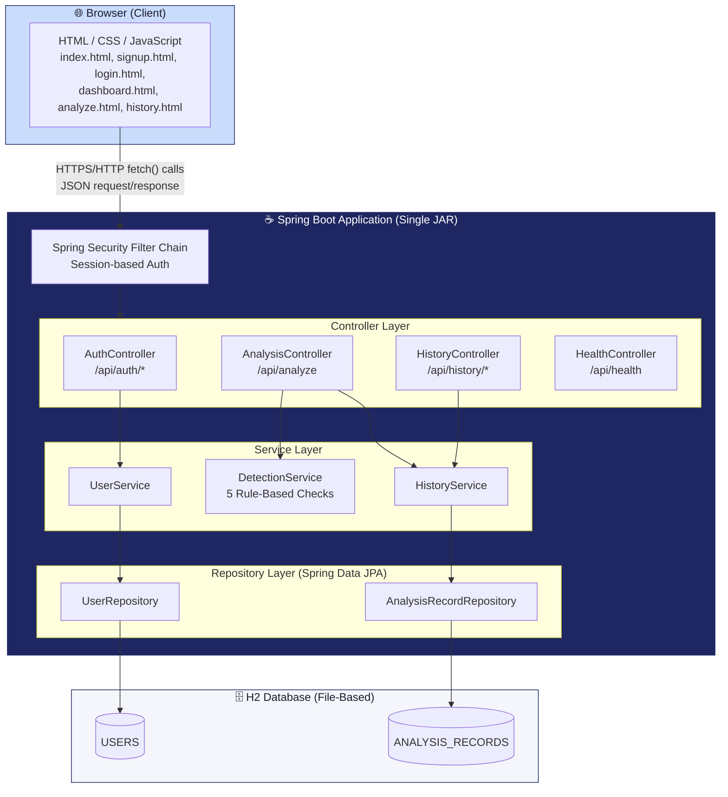
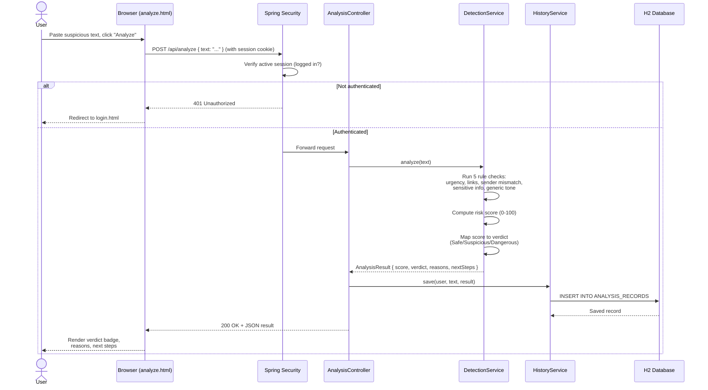
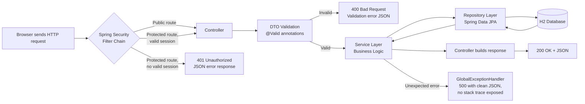

# VShield.ai — System Architecture

*Day 2 Deliverable — AB Talks 60-Day Claude AI Challenge Capstone*

This document is the single source of truth for how VShield.ai's components fit together. It complements the PRD (what we're building) and the Implementation Blueprint (how we build it day by day).

---

## 1. Component Diagram

VShield.ai is a monolithic Spring Boot application: one deployable JAR serves both the REST API and the static frontend. There is no separate frontend server, no microservices, and no external AI/ML service — this keeps deployment (Day 9) simple and matches the PRD's rule-based, dependency-light design.

**Key design decision:** `DetectionService` is a pure, standalone Java service with no dependency on Spring Web or the database (per Day 4 of the blueprint). It's called by `AnalysisController` but could be unit-tested entirely on its own. This keeps the detection logic explainable, portable, and easy to debug.

---

## 2. Data Flow — "Paste and Analyze" (Core Product Loop)

This is the primary flow the entire product is built around.

---

## 3. Request Lifecycle (Every API Call)

All `/api/**` requests (except `/api/auth/signup`, `/api/auth/login`, and `/api/health`) pass through this lifecycle:

---

## 4. AI Interaction

**None in v1.0.** Per PRD Section 6 and Section 10, VShield.ai's detection engine is intentionally **rule-based only** — no calls to Claude, OpenAI, or any external AI/ML API. This is a deliberate architectural choice:

- Every verdict is fully explainable (a manager can see exactly which of the 5 rules triggered).
- No API costs, no rate limits, no network dependency for the core feature.
- Faster and more predictable for a live demo.

This is documented here so no future day accidentally introduces an AI dependency without an explicit scope-change discussion. AI-assisted detection is captured in PRD Section 12 (Future Scope, v2.0+) only.

---

## 5. External Services

| Service | Purpose | When Used |
|---|---|---|
| **GitHub** | Source control, backup, deployment trigger | Every day, and specifically Day 9 (deploy) |
| **Free-tier hosting platform** (Render/Railway — finalized Day 9) | Runs the live public JAR | Day 9 onward |
| **Spring Initializr** (start.spring.io) | One-time project scaffolding | Day 2 only (already used) |

No payment gateways, no email services (no email verification per PRD), no third-party analytics, and no CDN dependencies beyond an optional Google Font link (Day 7 polish). This keeps the external surface area minimal — fewer things that can break during the demo.

---

## 6. Architectural Principles Guiding Every Day Going Forward

1. **Single deployable unit.** Frontend and backend ship together in one JAR — no CORS complexity, no separate hosting for frontend/backend.
2. **Explainability over cleverness.** `DetectionService` must always be able to say *why* it flagged something — this is a product requirement, not just an implementation detail.
3. **Session-based auth, not JWT.** Simpler to reason about at comfort-level 1/5, sufficient for a single-server v1.0 with no mobile app.
4. **DTOs at the boundary.** Controllers never return JPA entities directly (avoids lazy-loading errors and accidentally leaking internal fields) — this is formalized here and will be implemented starting Day 3.
