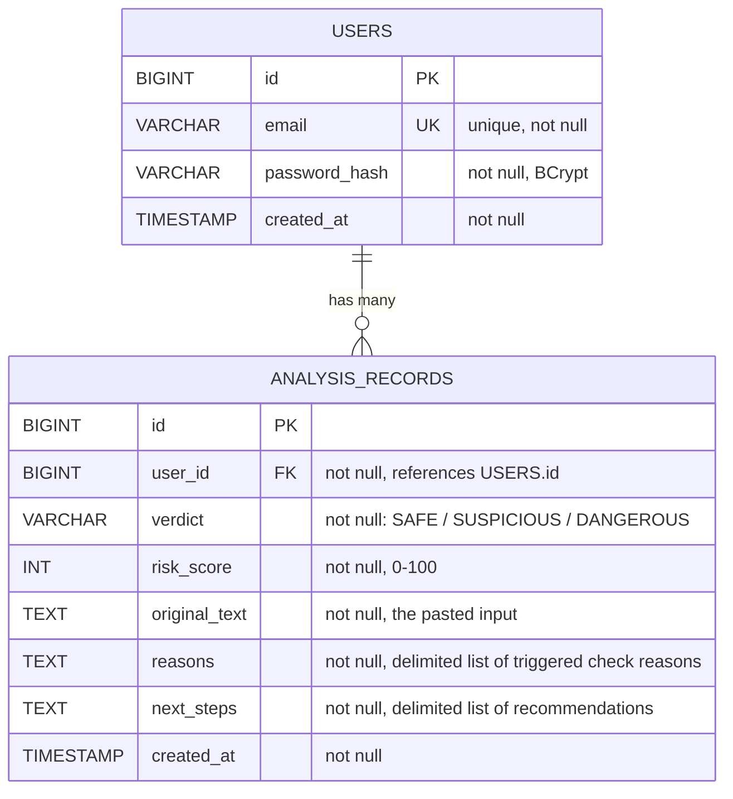

# VShield.ai — Database Schema

*Day 2 Deliverable — validated against every user story in the PRD*

Database: **H2**, running in **file-based mode** (not in-memory) so data survives application restarts — required for the History Log feature to actually be useful across sessions. This is a change from today's default Spring Initializr config (in-memory `jdbc:h2:mem:...`) and will be applied via `application.properties` at the start of Day 3, before the User entity is built.

---

## 1. Entity-Relationship Diagram



---

## 2. Table: `USERS`

| Column | Type | Constraints | Notes |
|---|---|---|---|
| `id` | `BIGINT` | `PRIMARY KEY`, `AUTO_INCREMENT` | JPA `@GeneratedValue` |
| `email` | `VARCHAR(255)` | `NOT NULL`, `UNIQUE` | Used as the login identifier; validated with `@Email` at the DTO level (Day 3) |
| `password_hash` | `VARCHAR(255)` | `NOT NULL` | BCrypt hash — **never** the plain password. Never returned in any API response. |
| `created_at` | `TIMESTAMP` | `NOT NULL` | Set once at signup via `LocalDateTime.now()` |

**Why no `username` field?** The PRD specifies email + password only, no separate username — keeps signup as simple as possible for the target user (a busy social media manager, not a technical user).

**Why no `updated_at` / `last_login`?** Out of scope for v1.0 — no profile editing or login-tracking features exist in the PRD. Adding these now would be premature complexity (avoiding scope creep per our standing rule).

---

## 3. Table: `ANALYSIS_RECORDS`

| Column | Type | Constraints | Notes |
|---|---|---|---|
| `id` | `BIGINT` | `PRIMARY KEY`, `AUTO_INCREMENT` | JPA `@GeneratedValue` |
| `user_id` | `BIGINT` | `NOT NULL`, `FOREIGN KEY → USERS(id)` | Every record must belong to exactly one user — enforces the PRD's "private history" requirement at the database level, not just the application level |
| `verdict` | `VARCHAR(20)` | `NOT NULL` | One of `SAFE`, `SUSPICIOUS`, `DANGEROUS` — stored as a Java `enum` mapped with `@Enumerated(EnumType.STRING)` (readable in the DB, not a raw number) |
| `risk_score` | `INT` | `NOT NULL`, range 0–100 | Enforced in application logic (`DetectionService`), not a DB constraint, to keep the schema simple |
| `original_text` | `TEXT` (`CLOB` in H2) | `NOT NULL` | The full pasted message/email/link text — stored as-is so a manager can review exactly what they checked |
| `reasons` | `TEXT` | `NOT NULL` | The list of triggered check explanations, stored as a single delimited string (e.g., `\|`-separated) and split back into a list when read. See "Design Decision" below. |
| `next_steps` | `TEXT` | `NOT NULL` | Same delimited-string approach as `reasons` |
| `created_at` | `TIMESTAMP` | `NOT NULL` | Set at analysis time — used to sort history "newest first" per the PRD |

### Design Decision: Why store `reasons`/`next_steps` as delimited text instead of a separate table?

A fully normalized design would put reasons in their own `CHECK_RESULTS` table with a foreign key back to `ANALYSIS_RECORDS`. We're deliberately **not** doing that for v1.0:

- The PRD's detection engine always produces a small, bounded list (at most 5 reasons — one per rule).
- A separate table adds a join, an extra repository, and extra mapping code for a beginner-level build, with no real benefit at this scale.
- If v2.0 needs to query/filter by individual reasons (e.g., "show me all checks flagged for sensitive-info requests"), this can be normalized then — a reasonable, documented trade-off, not an oversight.

---

## 4. Relationships & Constraints Summary

- **One-to-Many:** One `USERS` row has many `ANALYSIS_RECORDS` rows (`@OneToMany` on `User`, `@ManyToOne` on `AnalysisRecord`).
- **Referential integrity:** `ANALYSIS_RECORDS.user_id` is a required foreign key — an analysis record can never exist without an owning user.
- **Uniqueness:** `USERS.email` is unique — enforced at the database level (`@Column(unique = true)`) *and* checked explicitly in `AuthController` before insert, so we can return a friendly "email already in use" message instead of a raw database constraint-violation error.
- **Security boundary:** Every query in `AnalysisRecordRepository` that returns records **must** filter by the requesting user (`findByUserOrderByCreatedAtDesc(User user)`), never a bare `findAll()`. This is called out explicitly here because it's a security-critical rule, not just a style preference — a bug here would let one user see another's private data.

---

## 5. Schema Validated Against Every PRD User Story

| User Story (PRD Section 8) | Schema Support |
|---|---|
| "Sign up and log in securely, so my history stays private to me" | `USERS` table with hashed password; `ANALYSIS_RECORDS.user_id` FK scopes all data per user |
| "Paste a suspicious message and get an instant verdict" | `ANALYSIS_RECORDS.verdict`, `.risk_score` capture the output; `original_text` captures the input |
| "See why something was flagged, to explain it to my client" | `ANALYSIS_RECORDS.reasons` stores the exact explanation shown at analysis time, permanently |
| "View my past checks, to track patterns across clients" | `ANALYSIS_RECORDS.created_at` enables newest-first ordering; all fields needed to redisplay a past result are stored (no re-computation needed) |

Every user story maps to a concrete column — no speculative fields, no unused tables.

---

## 6. Migration Note for Day 3

Today's Spring Initializr setup uses H2 in **in-memory** mode (`jdbc:h2:mem:...`, visible in Day 2's console logs), which wipes data on every restart. Before building the `User` entity on Day 3, we will update `application.properties` to file-based mode, e.g.:

```properties
spring.datasource.url=jdbc:h2:file:./data/vshielddb
spring.datasource.driverClassName=org.h2.Driver
spring.jpa.hibernate.ddl-auto=update
```

This ensures signup/login data and history persist across app restarts during development — essential for testing the History Log feature realistically.
