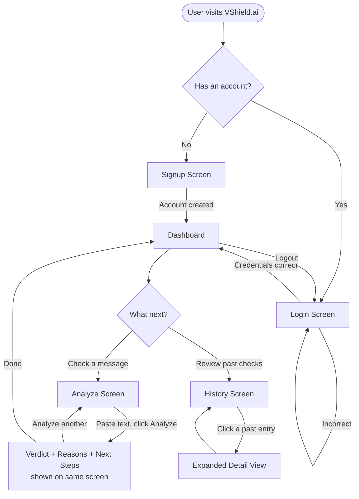
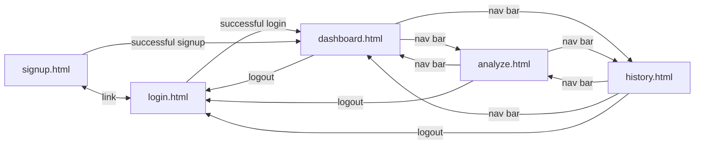

# VShield.ai — UI & User Flow

*Day 2 Deliverable — low-fidelity wireframes, every screen justified*

---

## 1. User Flow Diagram



**Why this flow works for the target user (a busy social media manager):** every path from login to a usable result is 2 clicks or fewer (Dashboard → Analyze → Analyze). There's no unnecessary onboarding, tutorial, or settings step in v1.0 — the PRD explicitly calls for a tool usable "without training."

---

## 2. Screen Flow (Navigation Map)



A shared navigation bar (built Day 7) appears on `dashboard.html`, `analyze.html`, and `history.html`, so a user is never more than one click away from any core feature. `signup.html` and `login.html` are intentionally nav-bar-free — a logged-out user shouldn't see internal navigation.

---

## 3. Screen Inventory — Every Screen and Why It Exists

| Screen | Purpose | Built On |
|---|---|---|
| `signup.html` | New user account creation | Day 3 |
| `login.html` | Returning user authentication | Day 3 |
| `dashboard.html` | Landing screen after login; orientation + entry point to the two core features | Day 3 (placeholder) → Day 7 (polished) |
| `analyze.html` | The core product — paste text, get a verdict | Day 5 |
| `history.html` | View past analyses | Day 6 |

No screen exists "just in case" — each one maps directly to a PRD user story (Section 8).

---

## 4. Wireframes (Low-Fidelity)

### 4.1 `signup.html`

```
┌──────────────────────────────────────────┐
│                                            │
│              🛡  VShield.ai                │
│      Scam & impersonation detection        │
│                                            │
│   ┌────────────────────────────────────┐  │
│   │  Create your account                │  │
│   │                                      │  │
│   │  Email                              │  │
│   │  ┌────────────────────────────────┐ │  │
│   │  │                                │ │  │
│   │  └────────────────────────────────┘ │  │
│   │                                      │  │
│   │  Password                           │  │
│   │  ┌────────────────────────────────┐ │  │
│   │  │                                │ │  │
│   │  └────────────────────────────────┘ │  │
│   │                                      │  │
│   │  [ 400/401 error message if any ]   │  │
│   │                                      │  │
│   │  ┌────────────────────────────────┐ │  │
│   │  │          Sign Up               │ │  │
│   │  └────────────────────────────────┘ │  │
│   │                                      │  │
│   │  Already have an account? Log in    │  │
│   └────────────────────────────────────┘  │
│                                            │
└──────────────────────────────────────────┘
```

### 4.2 `login.html`

```
┌──────────────────────────────────────────┐
│                                            │
│              🛡  VShield.ai                │
│                                            │
│   ┌────────────────────────────────────┐  │
│   │  Welcome back                       │  │
│   │                                      │  │
│   │  Email                              │  │
│   │  ┌────────────────────────────────┐ │  │
│   │  └────────────────────────────────┘ │  │
│   │                                      │  │
│   │  Password                           │  │
│   │  ┌────────────────────────────────┐ │  │
│   │  └────────────────────────────────┘ │  │
│   │                                      │  │
│   │  [ error message if login fails ]   │  │
│   │                                      │  │
│   │  ┌────────────────────────────────┐ │  │
│   │  │          Log In                │ │  │
│   │  └────────────────────────────────┘ │  │
│   │                                      │  │
│   │  New here? Create an account        │  │
│   └────────────────────────────────────┘  │
│                                            │
└──────────────────────────────────────────┘
```

### 4.3 `dashboard.html`

```
┌──────────────────────────────────────────────────────┐
│ 🛡 VShield.ai   Dashboard   Analyze   History   Logout │  ← shared nav (Day 7)
├──────────────────────────────────────────────────────┤
│                                                        │
│   Welcome back, manager@agency.com                    │
│                                                        │
│   VShield.ai helps you vet suspicious offers before    │
│   you respond — paste any message, email, or link.     │
│                                                        │
│   ┌──────────────────────┐  ┌──────────────────────┐  │
│   │  🔍 Analyze a Message │  │  📜 View History      │  │
│   │  Check a new message  │  │  Review past checks   │  │
│   │  for scam signals      │  │  across your clients  │  │
│   └──────────────────────┘  └──────────────────────┘  │
│                                                        │
└──────────────────────────────────────────────────────┘
```

### 4.4 `analyze.html` — Input State

```
┌──────────────────────────────────────────────────────┐
│ 🛡 VShield.ai   Dashboard   Analyze   History   Logout │
├──────────────────────────────────────────────────────┤
│                                                        │
│   Paste a message, email, or link to check             │
│                                                        │
│   ┌────────────────────────────────────────────────┐ │
│   │                                                  │ │
│   │  (large textarea)                                │ │
│   │                                                  │ │
│   │                                                  │ │
│   └────────────────────────────────────────────────┘ │
│                                                        │
│                              ┌───────────────────┐    │
│                              │     Analyze       │    │
│                              └───────────────────┘    │
│                                                        │
└──────────────────────────────────────────────────────┘
```

### 4.5 `analyze.html` — Result State

```
┌──────────────────────────────────────────────────────┐
│ 🛡 VShield.ai   Dashboard   Analyze   History   Logout │
├──────────────────────────────────────────────────────┤
│                                                        │
│   [ ...textarea with pasted text, collapsed... ]      │
│                              ┌───────────────────┐    │
│                              │     Analyze       │    │
│                              └───────────────────┘    │
│                                                        │
│   ┌────────────────────────────────────────────────┐ │
│   │  🔴 DANGEROUS          Risk Score: 85 / 100      │ │
│   │  ──────────────────────────────────────────────  │ │
│   │  Why this was flagged:                           │ │
│   │   • Urgent/pressure language detected             │ │
│   │   • Suspicious shortened link (bit.ly)            │ │
│   │   • Sender claims "Nike" with no matching domain  │ │
│   │   • Requests your password                        │ │
│   │  ──────────────────────────────────────────────  │ │
│   │  What to do next:                                 │ │
│   │   • Do not click the link                         │ │
│   │   • Never share your password                     │ │
│   │   • Verify via Nike's official channels            │ │
│   │   • Consider blocking and reporting                │ │
│   └────────────────────────────────────────────────┘ │
│                                                        │
└──────────────────────────────────────────────────────┘
```

*Verdict badge color coding: 🟢 Safe = green, 🟡 Suspicious = amber, 🔴 Dangerous = red — consistent everywhere the verdict appears (analyze screen, history list, history detail).*

### 4.6 `history.html` — List State

```
┌──────────────────────────────────────────────────────┐
│ 🛡 VShield.ai   Dashboard   Analyze   History   Logout │
├──────────────────────────────────────────────────────┤
│                                                        │
│   Your past checks                                     │
│                                                        │
│   ┌────────────────────────────────────────────────┐ │
│   │ 🔴 DANGEROUS   Jul 23, 10:15am                    │ │
│   │ "Hi! We are Nike and want to offer you..."        │ │
│   ├────────────────────────────────────────────────┤ │
│   │ 🟢 SAFE        Jul 22, 4:40pm                     │ │
│   │ "Hi, this is Sarah from Acme Co. reaching..."     │ │
│   ├────────────────────────────────────────────────┤ │
│   │ 🟡 SUSPICIOUS  Jul 21, 9:02am                     │ │
│   │ "Congratulations! You've been selected..."        │ │
│   └────────────────────────────────────────────────┘ │
│                                                        │
└──────────────────────────────────────────────────────┘
```

### 4.7 `history.html` — Empty State (new user)

```
┌──────────────────────────────────────────────────────┐
│ 🛡 VShield.ai   Dashboard   Analyze   History   Logout │
├──────────────────────────────────────────────────────┤
│                                                        │
│   Your past checks                                     │
│                                                        │
│              No checks yet.                            │
│      Analyze your first message to get started.        │
│                                                        │
│              ┌────────────────────────┐               │
│              │   Analyze a Message    │               │
│              └────────────────────────┘               │
│                                                        │
└──────────────────────────────────────────────────────┘
```

### 4.8 `history.html` — Expanded Detail (click on a list item)

Reuses the exact same result card layout as 4.5 (Analyze Result State), so a user never has to learn a second way to read a verdict — consistency by design, not extra work.

---

## 5. Navigation Rules Summary

1. **Logged-out screens** (`signup.html`, `login.html`) have no nav bar — nothing to navigate to yet.
2. **Logged-in screens** always show the same 4-item nav bar: Dashboard, Analyze, History, Logout — no screen is ever a dead end.
3. **The Analyze button is the app's single most important call-to-action** — it appears on the Dashboard, in the empty History state, and is the default screen a manager reaches for. Every design decision this week should protect that button's prominence and simplicity.
4. No screen requires more than one piece of information from the user at a time (email+password together is the only exception, and that's a standard, expected pairing).
